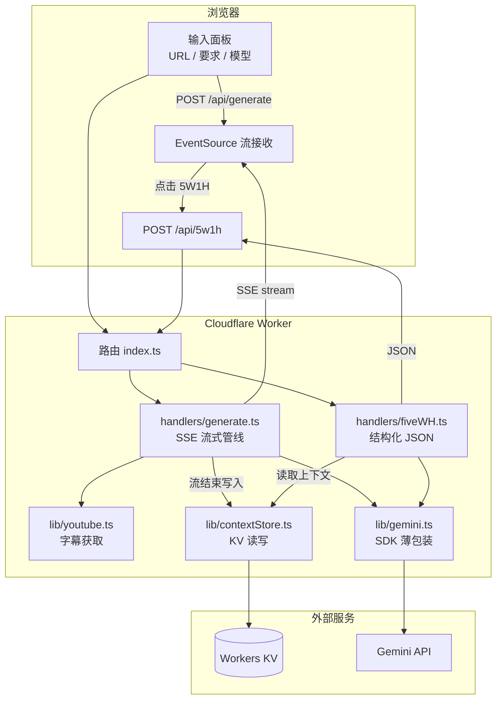

# 架构详细文档

> 本文是对 README 所述技术的**深度展开**，包含流式协议设计、SSE 事件时序、模块职责边界、Prompt 模板结构、字幕双通道实现方案。

---

## 目录

- [1. 系统架构总览](#1-系统架构总览)
- [2. 流式协议设计（SSE）](#2-流式协议设计sse)
- [3. 字幕策略](#3-字幕策略)
- [4. Gemini 流式接入](#4-gemini-流式接入)
- [5. Prompt 约束边界](#5-prompt-约束边界)
- [6. 章节与 5W1H](#6-章节与-5w1h)
- [7. 模块职责边界](#7-模块职责边界)

---

## 1. 系统架构总览



### 请求生命周期

**生成主文章**：
1. 浏览器 `POST /api/generate`，body 含 `{ url, userRequirements?, model }`
2. Worker 从 `getSubtitle(url)` 获取字幕文本
3. 拼接 prompt（系统指令 + 字幕 + 可选约束块）
4. 调用 `ai.models.generateContentStream()`，async iterator 产出 chunk
5. 每个 chunk 经过 **SSE 编码管线**：拆分章节边界 → 发射 `chapter` 事件 → 发射 `chunk` 事件
6. 流结束 → 提取 `chapters[]` 结构 → 写入 KV `{ subtitles, articleHtml, chapters }` → 发射 `done{ articleId }`

**5W1H 总结**：
1. 浏览器 `POST /api/5w1h`，body 含 `{ articleId, chapterId }`
2. Worker 从 KV 读 `{ subtitles, articleHtml, chapters[] }`，定位到目标章节文本
3. 拼接 prompt：系统指令 + 全文字幕 + 整篇文章 + 目标章节内容
4. 调用 Gemini（同步，非流式），传入 `responseSchema`
5. 返回 JSON `{ who, what, when, where, why, how }`

---

## 2. 流式协议设计（SSE）

### 为什么是 SSE 不是 WebSocket

| 对比项 | SSE | WebSocket |
|---|---|---|
| 方向 | **单向**（仅服务端→浏览器） | 双向 |
| 浏览器 API | `EventSource`（原生） | `WebSocket`（原生） |
| 自动重连 | ✅ 内置 | ❌ 手动实现 |
| 事件类型 | `event:` 字段语义清晰 | 消息类型自己定义 |
| 适用场景 | 推送长文本（LLM 流式） | 实时协作消息 |
| Worker 兼容 | `TransformStream` + SSE headers | 需 upgrade 握手 |

**结论**：我们只需要"服务端往浏览器推文本"这一个方向，SSE 的自动重连和事件类型语义都是白送的，且 Worker 的 SSE 实现极干净。WebSocket 在这道题里是过度工程。

### SSE 事件类型定义

| 事件名 | 方向 | 载荷 | 触发时机 |
|---|---|---|---|
| `chapter` | 服务端→浏览器 | `{ id, title, index }` | 检测到章节边界时（LLM 刚输出 `<section>` 标签） |
| `chunk` | 服务端→浏览器 | HTML 片段字符串 | 持续，LLM 每输出一段 token |
| `done` | 服务端→浏览器 | `{ articleId }` | 流完全结束 |
| `error` | 服务端→浏览器 | `{ code, message }` | 生成过程中断（Gemini 超时 / 字幕失败） |

### 时序图

```
浏览器                          Worker                      Gemini API
  │                               │                            │
  │── POST /api/generate ────────►│                            │
  │                               │── generateContentStream ──►│
  │                               │                            │
  │                               │ ◄──── chunk 1 ────────────│
  │                               │  (含 <section> 标记)       │
  │                               │  [buffer 检测到章节边界]    │
  │  ◄── event:chapter ──────────│                            │
  │       data: {id,title,index} │                            │
  │  ◄── event:chunk ────────────│                            │
  │       data: "<h2>标题</h2>…" │                            │
  │                               │ ◄──── chunk 2 ────────────│
  │  ◄── event:chunk ────────────│                            │
  │       data: "<p>内容…</p>"   │                            │
  │                               │                            │
  │                               │ ◄──── chunk 3 ────────────│
  │                               │  (含下一个 <section> 标记) │
  │  ◄── event:chapter ──────────│                            │
  │       data: {id,title,index} │                            │
  │  ◄── event:chunk ────────────│                            │
  │  ...                          ...                          ...
  │                               │── KV.put(articleId, ctx) ─│
  │  ◄── event:done ─────────────│                            │
  │       data: {articleId:"a_xxx"}                           │
  │                               │                            │
  │── POST /api/5w1h ───────────►│                            │
  │    {articleId, chapterId}    │── KV.get(articleId) ────── │
  │                               │── generateContent ───────►│
  │  ◄── JSON: {who,what,...} ──-│ ◄──── JSON ───────────────│
```

**关键说明**：章节边界检测发生在 Worker **接收 Gemini chunk 之后**——Worker 将 chunk 写入内部 buffer，从 buffer 中匹配完整 `<section>` 标签，匹配成功则先发 `chapter` 事件、再发包含该标签的 `chunk` 事件。这保证了前端总是先收到 chapter 元数据再收到章节内容。

### 浏览器端处理

```ts
const es = new EventSource('...');
es.addEventListener('chapter', (e) => {
  const chapter = JSON.parse(e.data);
  addChapterHeading(chapter);   // 插入章节标题 + [5W1H] 按钮
});
es.addEventListener('chunk', (e) => {
  appendHTML(e.data);           // 追加到文章容器
});
es.addEventListener('done', (e) => {
  articleId = JSON.parse(e.data).articleId;
  enable5W1H();                 // 所有 [5W1H] 按钮生效
});
es.addEventListener('error', (e) => {
  showError(JSON.parse(e.data).message);
});
```

---

## 3. 字幕策略

### 问题背景

Cloudflare Worker 的 `fetch()` API 运行在 Cloudflare 的边缘数据中心，其 IP 段为公开已知的 Worker 出口 IP。YouTube 对这些 IP 段的字幕请求有严格的**反爬风控**：

- 常见返回 captcha HTML 页面（而非字幕 JSON）
- 可能直接返回 429 / 403
- 即使一时可用，也不保证长期稳定

常规 Node.js 解决方案——配置 HTTP 代理（如 `https-proxy-agent` 或 `socks-proxy-agent`）——**在 Worker 上不可用**，因为 Worker 的 `fetch` 是平台 API，不支持 `agent` 参数。

### 三段式实现

```
getSubtitle(videoId) → string
  ├─ P0: videoId === 'xRh2sVcNXQ8' → 返回硬编码字幕（核心演示路径）
  ├─ P1: try youtube 字幕直连 fetch → 成功则返回字幕文本
  └─ P1 失败 → 返回友好错误信息（"字幕获取失败，请使用示例视频 xRh2sVcNXQ8"）
```

P0 和 P1 是**级联关系**：先检查是否命中硬编码（O(1) 判断），命中则直接返回不走网络；未命中才尝试 P1 直连拉取。P1 失败不走代理（P2 未实现），而是给用户明确错误提示。

### 为什么要先匹配硬编码

**不是"懒得做"，而是故意为之**：

- 面试官验证时会用**文档示例视频** `xRh2sVcNXQ8`，硬编码命中保证 100% 稳定
- 流式生成 + 5W1H 才是题眼，不能让字幕波动影响主能力的演示
- `youtubei.js` 拉取作为 bonus（体现"做了思考"），不依赖它演示

### TCP Socket 代理方案（设计思路，未实现）

如果未来需要 captcha 兜底，唯一的路是：

```ts
import { connect } from 'cloudflare:sockets';

// 1. TCP 连接到 webshare 代理服务器
const socket = connect({ hostname: 'p.webshare.io', port: 80 });

// 2. 在 TCP 连接上发送 HTTP CONNECT 握手（RFC 7231）
const writer = socket.writable.getWriter();
const encoder = new TextEncoder();
await writer.write(encoder.encode(
  `CONNECT www.youtube.com:443 HTTP/1.1\r\n` +
  `Host: www.youtube.com:443\r\n` +
  `Proxy-Authorization: Basic ${btoa('user:pass')}\r\n` +
  `\r\n`
));

// 3. 读代理返回，200 后开始 TLS 握手 + 正式请求
// ...

// 4. 通过 TLS socket 发 HTTP 请求拿字幕
```

**未实现原因**：
1. 工作量不低——在 TCP 上手写 HTTP CONNECT + TLS 协商，调试需大量人力
2. 需要 webshare 付费账号（免费版也有，但配置步骤多）
3. 字幕在本题不是考点，投这个时间不如打磨 5W1H 的 prompt 质量
4. 取舍本身就是 README 值得讲的内容

---

## 4. Gemini 流式接入

### 库选型

使用 `@google/genai`（新版统一 SDK），而非旧的 `@google/generative-ai`：

| 对比项 | `@google/genai`（新版） | `@google/generative-ai`（旧版） |
|---|---|---|
| 包名 | `@google/genai` | `@google/generative-ai` |
| Worker 兼容 | ✅ 纯 fetch 实现 | ✅ 也兼容 |
| `generateContentStream` | ✅ | ✅ |
| `responseSchema` | ✅ 原生支持 | ❌ |
| stream 输出流形态 | `AsyncGenerator<GenerateContentResponse>` | `AsyncGenerator` |
| 维护状态 | 活跃（2025 年起主推） | 已 deprecated |

**结论**：用新版 `@google/genai`，理由：
1. `responseSchema` 原生支持——这对 5W1H 的结构化输出至关重要
2. 新 SDK 推荐作为 Gemini API 的长期接入方式
3. `AsyncGenerator<GenerateContentResponse>` 可配合 `for await...of` 直接消费

### 模型选择

| 模型 | 场景 | 特性 |
|---|---|---|
| `gemini-2.5-pro` | **默认**（主文章生成 + 5W1H 总结） | 质量高，中文文章更精致 |
| `gemini-2.5-flash` | 用户切换（速度优先） | 首 token 延迟低，流式体验更快 |

模型在前端 dropdown 中选择，后端 `/api/generate` 接受 `model` 参数并有白名单校验。

### 流式管线（核心实现）

```ts
// lib/gemini.ts
export async function* streamGemini(
  model: string,
  prompt: string,
  apiKey: string,
): AsyncGenerator<string> {
  const ai = new GoogleGenAI({ apiKey });
  const stream = await ai.models.generateContentStream({
    model,
    contents: prompt,
    config: {
      maxOutputTokens: 8_192,
      temperature: 0.7,
    },
  });
  for await (const chunk of stream) {
    const text = chunk.text;
    if (text) yield text;
  }
}
```

```ts
// handlers/generate.ts（核心流式管线 + 章节边界检测）

async function processStream(
  writer: WritableStreamDefaultWriter,
  encoder: TextEncoder,
  params: GenerateParams,
  env: Env,
) {
  const prompt = buildArticlePrompt(params.subtitles, params.userRequirements);
  const chapters: ChapterMeta[] = [];
  let fullHtml = '';
  let buffer = '';  // 跨 chunk 的拼接 buffer——解决 <section> 标签被拆分的问题

  try {
    for await (const text of streamGemini(params.model, prompt, env.GEMINI_API_KEY)) {
      buffer += text;

      // 尝试从 buffer 中匹配完整的 <section> 开标签
      // 注意：LLM 输出的 token 切片是任意的，<section data-chapter-id="ch-1"...>
      // 可能跨多个 chunk，因此必须在累积 buffer 上做匹配
      const sectionRegex = /<section\s+data-chapter-id="([^"]+)"\s+data-title="([^"]+)"[^>]*>/g;
      let match: RegExpExecArray | null;
      let lastFlushEnd = 0;

      while ((match = sectionRegex.exec(buffer)) !== null) {
        const chapterId = match[1];
        const title = match[2];
        const index = chapters.length;
        chapters.push({ id: chapterId, title, index });

        // 发送 chapter 事件（前端立即渲染标题 + [5W1H] 按钮）
        writer.write(encoder.encode(
          `event: chapter\ndata: ${JSON.stringify({ id: chapterId, title, index })}\n\n`
        ));
        lastFlushEnd = match.index + match[0].length;
      }

      // 安全 flush 策略：保留 buffer 尾部可能不完整的部分（<section 可能跨 chunk）
      const safeFlushPoint = buffer.lastIndexOf('<', buffer.length - 1);
      const flushEnd = safeFlushPoint > lastFlushEnd ? safeFlushPoint : buffer.length;
      const toFlush = buffer.slice(0, flushEnd);

      if (toFlush) {
        fullHtml += toFlush;
        writer.write(encoder.encode(`event: chunk\ndata: ${toFlush}\n\n`));
      }
      buffer = buffer.slice(flushEnd);
    }

    // flush 剩余 buffer
    if (buffer) {
      fullHtml += buffer;
      writer.write(encoder.encode(`event: chunk\ndata: ${buffer}\n\n`));
    }

    // 流结束：保存上下文到 KV
    const articleId = await saveContext(env, {
      subtitles: params.subtitles,
      articleHtml: fullHtml,
      chapters,
    });
    writer.write(encoder.encode(
      `event: done\ndata: ${JSON.stringify({ articleId })}\n\n`
    ));
  } catch (err) {
    writer.write(encoder.encode(
      `event: error\ndata: ${JSON.stringify({
        code: 'GENERATE_ERROR',
        message: err instanceof Error ? err.message : 'unknown error',
      })}\n\n`
    ));
  } finally {
    await writer.close().catch(() => {});
  }
}
```

**跨 chunk buffer 设计要点**：

LLM 流式输出的 token 切片是任意的——`<section data-chapter-id="ch-1">` 这 40+ 个字符完全可能分布在 2-3 个 chunk 中。如果只在单个 chunk 上做 `text.match()`，会漏检章节边界。

解决方案是维护一个 `buffer` 字符串：
1. 每个 chunk 拼入 buffer
2. 在 buffer 上做完整正则匹配（检测 `<section>` 标签）
3. **安全 flush**：只把 buffer 中"确定不会被拆分"的部分推给前端——最后一个 `<` 之前的内容是安全的（因为 `<` 可能是下一个标签的开头）
4. 未 flush 的尾部留在 buffer，等下一个 chunk 拼入后再处理
```

### 与纯 HTTP 调用的对比

```ts
// 另一种方案：直接用 fetch 调用 Gemini REST API
// const resp = await fetch(
//   `https://generativelanguage.googleapis.com/v1/models/gemini-2.5-pro:streamGenerateContent`,
//   { method: 'POST', headers: { 'x-goog-api-key': apiKey }, body: JSON.stringify({...}) }
// );
// const reader = resp.body.getReader();
```

**为什么选 SDK 而不是裸 fetch**：
1. SDK 封装了重试、API 端点路由、版本兼容——少写代码正是"忌臃肿"
2. 新版 SDK 的 `generateContentStream` 返回 `AsyncGenerator`，天然适合 `for await...of`
3. 裸 fetch 虽然不引入依赖，但要多写 JSON 解析、错误处理、token 流解析——约 60 行样板

---

## 5. Prompt 约束边界

### 主文章生成 Prompt 结构

```
【系统角色】
你是一个中文内容写作助手。你将收到一段 YouTube 字幕，请将其重构为一篇
排版精致的中文访谈对话稿。

【格式要求】
- 以<h1>输出文章标题
- 使用<h2>划分章节，每个章节以 <section data-chapter-id="ch-N"
  data-title="章节标题"> 开头，以</section>结尾
- 正文使用<p>段落，重要观点可加<strong>或<em>高亮
- 保持对话风格：保留 speaker 标记（如 "Mark: xxx"）

【用户生成要求（可选约束，可不全部覆盖，但不得超出此范围）】
{{ userRequirements }}

【字幕文本】
{{ subtitles }}
```

**约束块设计的意图**：
- `"可不全部覆盖"`：避免 LLM 因为"无法同时满足四个约束"而拒绝生成或自行添加超出范围的内容
- `"不得超出此范围"`：严格限定 LLM 的发挥空间——如果用户只说了"输出风格：技术文档风格"，模型不能自创一个"输出长度限制"（不在约束范围内）
- 这是非对称约束：LLM 可以选择**部分遵守**，但**不能添加新约束**

### 5W1H Prompt 结构

```
【系统角色】
你是一个中文内容分析助手。你将收到完整的 YouTube 字幕文章、最终生成的文章、
以及当前章节的内容，请对当前章节做 5W1H 分析。

【格式要求】
必须在 responseSchema 约束下输出有效 JSON。
输出仅包含 JSON，不包含其他文字。

【全文字幕】
{{ subtitles }}

【完整文章】
{{ fullArticle }}

【目标章节】
本章节标题：{{ chapterTitle }}
本章节 HTML：{{ chapterHtml }}

【输出 Schema】
{
  who: string,    // 主要涉及的人/角色
  what: string,   // 事件/内容主题
  when: string,   // 时间背景
  where: string,  // 发生场景/位置
  why: string,    // 原因/动机
  how: string,    // 方式/过程
}
```

**上下文复用设计要点**：
- 5W1H 需要"结合整篇视频内容与当前章节"——所以 prompt 拼接了**全文字幕 + 整篇文章 + 目标章节**，三份素材给全
- 但不交给前端传递——由后端从 KV 读取，防止会话状态丢失
- 使用 `responseSchema` 强制 JSON 格式，前端可以直接 `JSON.parse`

### 用户要求的生成影响

当 `userRequirements` 为空时，约束块不插入 prompt，LLM 无额外限制。
当 `userRequirements` 非空时，约束块注入到字幕之前，LLM 在所有输出中体现用户要求。

---

## 6. 章节与 5W1H

### 章节标记协议

Gemini 在输出文章时，按照 prompt 要求在每个章节前后插入：

```html
<section data-chapter-id="ch-1" data-title="智能经济：收入爆发与成本塌陷">
  <h2>智能经济：收入爆发与成本塌陷</h2>
  <p>Mark: ...</p>
</section>
```

`data-chapter-id` 的命名方案：按 Gemini 输出中出现的顺序依次编号 `ch-1`、`ch-2`……每一个 `<section>` 标签的出现触发一次 SSE `chapter` 事件。

### 5W1H 按钮交互

```html
<!-- 章节标题旁 -->
<h2>
  智能经济：收入爆发与成本塌陷
  <button class="w1h-btn" data-chapter-id="ch-1" data-chapter-title="智能经济：收入爆发与成本塌陷">
    [5W1H]
  </button>
</h2>

<!-- 点击后展开的结构化展示 -->
<div id="w1h-ch-1" class="w1h-panel hidden">
  <table>
    <tr><td class="label">Who</td><td>Mark</td></tr>
    <tr><td class="label">What</td><td>AI 行业的收入增长、商业模式…</td></tr>
    <tr><td class="label">When</td><td>当前 AI 商业化早期，以及未来十年</td></tr>
    <tr><td class="label">Where</td><td>消费者 AI 市场、企业 AI 市场…</td></tr>
    <tr><td class="label">Why</td><td>AI 可依托互联网快速触达全球用户…</td></tr>
    <tr><td class="label">How</td><td>通过消费者订阅、企业 token 计费…</td></tr>
  </table>
</div>
```

### 5W1H 调用流程

```
按钮点击
  │
  ├─ panel 已展开 → 关闭（toggle 隐藏）
  │
  └─ panel 为空 → POST /api/5w1h { articleId, chapterId }
       │
       ├─ Worker 从 KV 读上下文
       │   ├─ article subtitles（完整字幕）
       │   ├─ articleHtml（完整文章 HTML）
       │   └─ chapters[].html（目标章节 HTML）
       │
       ├─ 拼 prompt → Gemini → responseSchema JSON
       │
       └─ 返回 → 填充 panel → 显示
```

### 关键约束实现检查

> **5W1H 请求不得由前端重新提交整篇文章内容**

- ✅ 前端只发 `articleId`（nanoid 12 字符随机串）和 `chapterId`（如 "ch-1"）
- ✅ 整篇文章存储在 Workers KV 中，由后端读取
- ✅ 即使 articleId 被猜测或泄露，也只会读到该 articleId 的上下文，不会越权读取其他内容
- ✅ KV TTL 到期后自动清理过期数据

---

## 7. 模块职责边界

### Module Dependency Graph

```
index.ts
  ├── handlers/generate.ts    ──用──►  lib/youtube.ts
  │                                   lib/gemini.ts
  │                                   prompts.ts
  │                                   lib/contextStore.ts (写)
  │                                   lib/sse.ts
  │
  ├── handlers/fiveWH.ts      ──用──►  lib/gemini.ts
  │                                   prompts.ts
  │                                   lib/contextStore.ts (读)
  │
  └── (静态资源) public/index.html

lib/gemini.ts         ──调用──►  @google/genai SDK
lib/youtube.ts        ──调用──►  youtubei.js (或直接 fetch)
lib/contextStore.ts   ──绑定──►  env.CONTEXT_KV (Workers KV)
```

### 每个文件的职责（不超过 200 行）

| 文件 | 行数（预估） | 职责 | 原则 |
|---|---|---|---|
| `index.ts` | ~40 | 路由分发 `/api/generate` → handler，`/api/5w1h` → handler，其余 → `env.ASSETS` | 不做业务判断 |
| `generate.ts` | ~150 | 字幕获取 → prompt 拼接 → Gemini 流 → SSE 管线 → KV 落盘 | 最厚的文件，但只控制流程不处理数据 |
| `fiveWH.ts` | ~80 | KV 读 → prompt 拼接 → Gemini 同步调用 → responseSchema → JSON 返回 | 薄 handler |
| `youtube.ts` | ~60 | `getSubtitle(videoId): string` 三路策略 | 统一接口，切换不影响 handler |
| `gemini.ts` | ~50 | `generateArticle()` 和 `generateStructured()` 两个方法 | 薄包装，不超 SDK 能力 |
| `contextStore.ts` | ~40 | `saveContext()` 和 `getContext()` | KV 读写，含 TTL |
| `sse.ts` | ~20 | `toSSE(event, data): string` 纯函数 | 最小 helper，不内聚状态 |
| `prompts.ts` | ~80 | `buildArticlePrompt(subtitles, requirements)` 和 `build5W1HPrompt(…)` | prompt 集中的唯一位置 |
| `index.html` | 单文件 | 原生 HTML + Tailwind CDN + EventSource 流接收 | 独立自我维护 |

### 设计原则

1. **单层薄包装**：不引入 Service / Repository / Factory。lib 目录直接是 SDK 的薄包装，不是额外抽象层。
2. **prompt 集中管理**：prompts 有且只有一个文件，修改 prompt 不需要翻 handler 和 lib。这是 LLM 应用的核心维护点。
3. **流式管线在 handler 层**：`generate.ts` 是唯一直管 `TransformStream` 的文件，lib 层只负责产出 `AsyncGenerator<string>` 和辅助函数，不处理 SSE 协议细节。
4. **没有 "utils" 目录**：所有函数都有明确的归属。`toSSE()` 在 `sse.ts` 不在 `utils.ts`。细粒度的命名比 "utils" 更清晰。
